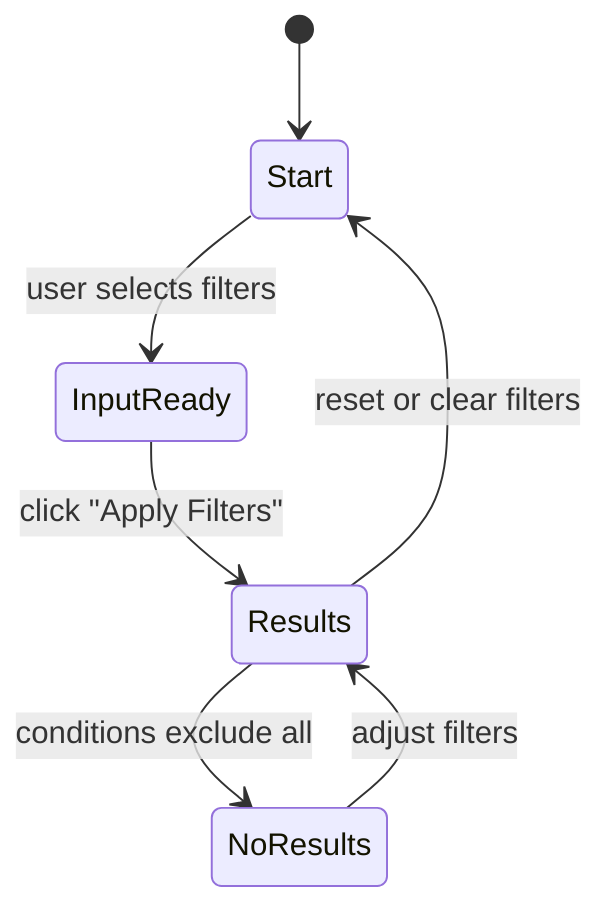

# 🧪 Week 4 Graded Assignment: Test Design Techniques on the E-Commerce Filter System

🎯 **Learning Objectives**

By completing this assignment, you will be able to:

- Apply **Equivalence Partitioning (EP)**, **Boundary Value Analysis (BVA)**, **Decision Table Testing (DTT)**, and **State/Flow Testing** techniques on a real interactive web application.  
- Create structured, traceable test cases from functional behavior.  
- Identify and document observable defects clearly and professionally.  
- Reflect on the role of systematic test design in improving coverage and quality.

---

## 📋 **What You’ll Need**

- 💻 VS Code with **Live Server** extension installed  
- 🌐 Any modern browser (Chrome, Edge, Firefox)  
- 📂 The provided file: `index.html` (E-Commerce Filter System)  
- 🧾 Markdown editor (VS Code is sufficient)

> **Note:** Do *not* change or fix the code. Your task is to **test and document**, not to refactor or debug.

---

## 🧩 **Scenario: SmartPhone Hub Filter System**

You are testing a small web application that helps users filter smartphones by **brand**, **price range**, and **storage**.  

The system should:
- Display correct products matching selected filters  
- Handle invalid or boundary inputs gracefully  
- Show “No products match your filters” when no result fits  

Your goal is to design structured test cases that uncover defects and validate expected behaviors.

---

## 🧪 **What You’ll Do**

### 1️⃣ Step 1: Run the Application
1. Open the provided `index.html` file in VS Code.  
2. Right-click → **Open with Live Server**.  
3. Explore the filter options manually.  
4. Observe how the app reacts to different input combinations.

---

### 2️⃣ Step 2: Equivalence Partitioning (EP)

**Objective:** Identify valid and invalid input *classes* for each field.

| Input | Partitions (Valid / Invalid) | Representative Value | Expected Behavior | Actual Behavior |
|--------|-------------------------------|----------------------|-------------------|-----------------|
| Brand |                               |                      |                   |                 |
| Price Range |                          |                      |                   |                 |
| Storage (GB) |                         |                      |                   |                 |

✅ **Task:**  
- Determine which classes of input should behave the same.  
- Test one value from each partition.  
- Note any deviations between *Expected* and *Actual*.

---

### 3️⃣ Step 3: Boundary Value Analysis (BVA)

**Objective:** Test edge values around valid input limits.

| Parameter | Boundaries Identified | Test Values (−1 / = / +1) | Expected | Actual | Notes |
|------------|------------------------|----------------------------|-----------|---------|--------|
| Storage (GB) | | | | | |
| Price Range | | | | | |

✅ **Task:**  
Focus on values close to **64 GB** (minimum) and **1024 GB** (maximum), and on price range boundaries (e.g., 500, 1000, 1500).  
Observe whether the app includes or excludes those limits correctly.

---

### 4️⃣ Step 4: Decision Table Testing (DTT)

**Objective:** Combine multiple inputs and predict outcomes.

| Brand | Price Range | Storage | Expected Outcome (count/message) | Actual Outcome | Pass/Fail |
|--------|--------------|----------|----------------------------------|----------------|-----------|
|        |              |          |                                  |                |           |

✅ **Task:**  
Create 6–10 representative combinations that reflect:
- Different filter conditions  
- Valid vs invalid intersections  
- “No result” scenarios  

Mark Pass/Fail after testing.

---

### 5️⃣ Step 5: State / Flow Testing

**Objective:** Identify major UI states and how they transition when the user interacts with the filters.

Use either a **Mermaid diagram** or a short **state table**.

Example structure (to customize):



✅ **Task:**  
- List the states you observed.  
- Describe which actions triggered them.  
- Note any missing or unexpected transitions.

---

### 6️⃣ Step 6: Defect Reports

Document **2–3 reproducible bugs** using a standard format:

```markdown
**Title:** [Brief description]  
**Steps to Reproduce:**  
1. ...
2. ...
3. ...

**Expected:**  
[Describe what should happen]

**Actual:**  
[Describe what actually happens]

**Severity:** Low / Medium / High  
**Notes:** (optional)

