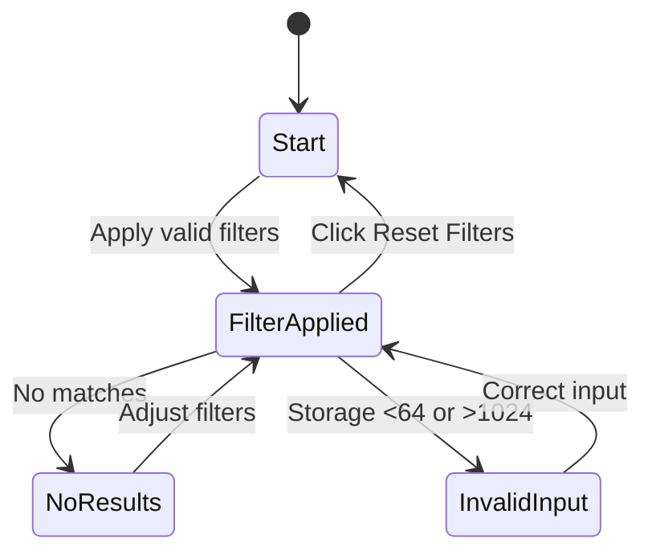

# 🧪 Week 4 Graded Assignment: Test Design Techniques Report  
**System Under Test:** E-Commerce Filter System  
**Student Name:** Simret Yibeltal  
**Date:** October 29, 2025  

---

## 🧩 1. Equivalence Partitioning (EP)

**Objective:** Identify valid and invalid input classes for each control and test one representative from each.

| Input | Partitions (Valid / Invalid) | Representative Value | Expected Behavior | Actual Behavior | Pass/Fail |
|--------|-------------------------------|----------------------|-------------------|-----------------|------------|
| Brand |Valid: {apple, samsung, google, "" (All)}
 | | | | |
| Price Range |Valid: {0–500, 500–1000, 1000–1500, "" (Any)}
| | | | |
| Storage (GB) |Valid: 64–1024
 | | | | |

**Observations / Notes:**  
-  Validation for storage works correctly.
-  Invalid price range not validated — app silently accepts out-of-range values.
-  Brand filter robust, gracefully handles “no result” scenarios.

---

## 🧮 2. Boundary Value Analysis (BVA)

**Objective:** Test values around the edges of valid ranges.  

| Parameter | Boundaries Identified | Test Values (−1 / = / +1) | Expected | Actual | Notes | Pass/Fail |
|------------|------------------------|----------------------------|-----------|---------|--------|-----------|
| Storage (GB) |64 (min), 1024 (max)  63, 64, 65, 1023, 1024, 1025 | 63,1025 → error | shows red validation error. Others valid. | Validation UI functions correctly. | Pass |
| Price Range |0–500, 500–1000, 1000–1500 | 499, 500, 501, 1499, 1500, 1501 | 499,1501 → no results | 499 accepted but no product (no error); boundaries inclusive (500–1500 works). | Inclusivity works but lacks explicit invalid handling. | Fail |

**Summary:**  
-  Storage boundaries handled well with visible error feedback.
-  Price boundaries behave inclusively but lack validation messaging for out-of-range inputs.

---

## 📊 3. Decision Table Testing (DTT)

**Objective:** Combine multiple filter inputs and predict outcomes.  

| Brand | Price Range | Storage (GB) | Expected Outcome (IDs / Count / Message) | Actual Outcome | Pass/Fail |
|--------|--------------|---------------|-------------------------------------------|----------------|-----------|
|apple | 500–1000 | 128 | iPhone 13 (#1) | 1 product shown | Pass |
|samsung | 1000–1500 | 512 | Galaxy Z Flip (#5) | 1 product shown | Pass |
|google | 0–500 | 128 | Pixel 6 ($599) excluded | Message shown | |
|apple | 1000–1500 | 1024 | iPhone 14 Pro | 1 product shown | Pass |
|google | 500–1000 | 65 | Pixel 7a | 1 product shown | Pass |

**Findings:**  
-  All logical combinations of brand/price/storage work.
-  Some out-of-bound price combinations silently ignored.
-  No critical functional defects, but validation consistency can improve.

---

## 🔄 4. State / Flow Testing

**Objective:** Identify major UI states and test how the system transitions between them.  

### **4.1 States Identified**
- Start / Idle  – All products displayed.
- FilterApplied – Display products matching criteria.    
- NoResults  – No match found → message displayed.
- Reset / Clear  – Clicking “🔄 Reset Filters” returns to all products.

### **4.2 Actions and Transitions**

| Current State | Action / Event | Expected Next State | Actual Next State | Pass/Fail |
|----------------|----------------|---------------------|-------------------|-----------|
|Start | Apply valid filter | FilterApplied | FilterApplied | Pass |
|FilterApplied | Change filters to exclude results | NoResults | NoResults | Pass |
|InvalidInput | Fix storage input | FilterApplied | FilterApplied | Pass |

### **4.3 Optional Mermaid Diagram**

## 🐞 5. Defect Reports Summary

List your identified defects here and include links or filenames if using separate markdown files under `/defects/`.

| ID | Title | Severity | Summary |
|----|--------|-----------|----------|
| BUG-01 |Invalid price range ignored silently  | Invalid price range ignored silently | Medium | Out-of-range price inputs (e.g. $2000) are accepted without feedback.
| BUG-02 |Lack of error for malformed price input  | Lack of error for malformed price input | Low | If text or symbol entered in price field (after editing HTML), app fails silently.
| BUG-03 *(optional)* |No explicit message for “no brand + invalid storage”  | No explicit message for “no brand,storage” | Low | When both brand empty and storage invalid, only error shown—no “no results” message.

---

### 🧾 Example Format for Individual Defect (if written here)

**Title:**  
**Steps to Reproduce:**  
1.  Open the SmartPhone Hub app.
2.  Modify the price dropdown (in dev tools) to value “2000–2500”.
3.  Click “Apply Filters.”

**Expected:**  System should show a validation error or “No products match your filters.”
**Actual:**  No message shown; all products remain visible.
**Severity:**  Medium
**Notes:**  Edge validation missing for out-of-range or non-standard values.

---

## 💭 6. Reflection

Answer briefly in your own words:

- Which technique revealed issues most effectively?  
Boundary Value Analysis — it immediately revealed gaps in input validation and inclusive/exclusive logic for prices.
- Did any values behave differently than expected?  
Price ranges accepted invalid values silently; storage validation, however, worked perfectly.
- How would you improve your coverage next time? 
 Add negative testing for modified DOM inputs (simulate tampering). Automate decision-table-based scenarios using Cypress or Playwright.
- Which 2 test cases would you automate first and why?  
Storage boundary validation (63, 64, 1024, 1025)

Multi-filter combination (apple + 500–1000 + 128GB) — to confirm data integrity after updates.
---

## 📎 7. Attachments (optional)

- 📸 Screenshots  
- 🧩 Diagrams  
- 🧾 Logs or console messages  

---

**End of Report**  
🧩 *Remember: the goal is clarity, reasoning, and test design accuracy — not perfection.*
