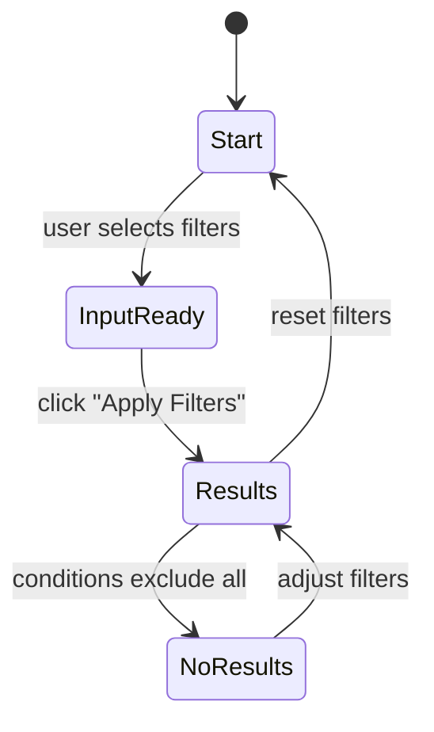

# 🧪 Week 4 Graded Assignment: Test Design Techniques Report  
**System Under Test:** E-Commerce Filter System  
**Student Name:** Simret Yibeltal  
**Date:** October 29, 2025  

---

## 🧩 1. Equivalence Partitioning (EP)

**Objective:** Identify valid and invalid input classes for each control and test one representative from each.

| Input | Partitions (Valid / Invalid) | Representative Value | Expected Behavior | Actual Behavior | Pass/Fail |
|--------|-------------------------------|----------------------|-------------------|-----------------|------------|
| Brand |Valid: {apple, samsung, google, "" (All)}
Invalid: {“nokia”, “123”, symbols} |Valid: “apple”
Invalid: “nokia” |Valid → Apple products displayed.
Invalid → Show “No products match your filters.” |“apple” → Products shown correctly.
“nokia” → Blank grid with message “No products match your filters.” |Pass |
| Price Range | | | | | |
| Storage (GB) | | | | | |

**Observations / Notes:**  
-  
-  

---

## 🧮 2. Boundary Value Analysis (BVA)

**Objective:** Test values around the edges of valid ranges.  

| Parameter | Boundaries Identified | Test Values (−1 / = / +1) | Expected | Actual | Notes | Pass/Fail |
|------------|------------------------|----------------------------|-----------|---------|--------|-----------|
| Storage (GB) | | | | | | |
| Price Range | | | | | | |

**Summary:**  
-  
-  

---

## 📊 3. Decision Table Testing (DTT)

**Objective:** Combine multiple filter inputs and predict outcomes.  

| Brand | Price Range | Storage (GB) | Expected Outcome (IDs / Count / Message) | Actual Outcome | Pass/Fail |
|--------|--------------|---------------|-------------------------------------------|----------------|-----------|
| | | | | | |
| | | | | | |
| | | | | | |
| | | | | | |
| | | | | | |

**Findings:**  
-  
-  

---

## 🔄 4. State / Flow Testing

**Objective:** Identify major UI states and test how the system transitions between them.  

### **4.1 States Identified**
- Start / Idle  
- InputReady  
- Results  
- NoResults  
- Reset / Clear  

### **4.2 Actions and Transitions**

| Current State | Action / Event | Expected Next State | Actual Next State | Pass/Fail |
|----------------|----------------|---------------------|-------------------|-----------|
| | | | | |
| | | | | |
| | | | | |

### **4.3 Optional Mermaid Diagram**

## 🐞 5. Defect Reports Summary

List your identified defects here and include links or filenames if using separate markdown files under `/defects/`.

| ID | Title | Severity | Summary |
|----|--------|-----------|----------|
| BUG-01 |  |  |  |
| BUG-02 |  |  |  |
| BUG-03 *(optional)* |  |  |  |

---

### 🧾 Example Format for Individual Defect (if written here)

**Title:**  
**Steps to Reproduce:**  
1.  
2.  
3.  

**Expected:**  
**Actual:**  
**Severity:**  
**Notes:**  

---

## 💭 6. Reflection

Answer briefly in your own words:

- Which technique revealed issues most effectively?  
- Did any values behave differently than expected?  
- How would you improve your coverage next time?  
- Which 2 test cases would you automate first and why?  

---

## 📎 7. Attachments (optional)

- 📸 Screenshots  
- 🧩 Diagrams  
- 🧾 Logs or console messages  

---

**End of Report**  
🧩 *Remember: the goal is clarity, reasoning, and test design accuracy — not perfection.*
